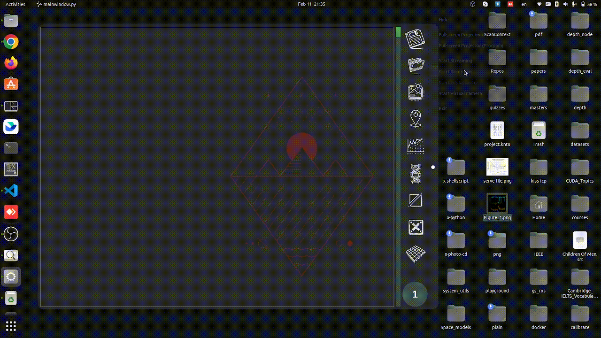

Here are the sections to update in your README to incorporate **functionality explanations** with **GIFs** for each feature:

---

## **Usage**

1. **Load an Image and Ground Control Points (GCPs)**

   The first step in using the toolbox is to load your input image along with the corresponding Ground Control Points (GCPs). This allows the system to establish the spatial reference for transforming the image.

   

2. **Perform Polynomial Regression**

   Polynomial regression is used for both **forward** and **backward transformations** of the image coordinates. This step computes the transformation parameters based on the input GCPs to geo-reference the image accurately.

   

3. **Apply Pointwise Correction**

   Pointwise correction refines the transformation accuracy by applying interpolation techniques like **Multiquadratic (MQ)** and **Local Distance Weighted (LDW)** methods. This helps to improve the precision of the georeferencing process. The first one is MQ and the second one is LDW.

   
   

3. **Meta-heuristic Term selection**

   Utilize the GA algorithm to select the corresponding terms, which all of the configurations can be done through GUI as well, it would then regress the points and report RMSE of the ICPs for each forward and backward. 
   The process also can be visualized using thirdparty scripts not implemented to the GUI.
   

4. **Resample the Image**

   After performing the transformation, the image is resampled to fit the newly transformed coordinates. Bilinear interpolation and multithreading are employed for efficient processing, ensuring minimal distortion.

   

5. **Use Piecewise Regression**

   Piecewise regression divides the dataset into smaller regions, enabling localized polynomial regression. This improves accuracy by applying different transformations to each region based on user-defined boundaries.

   

6. **Project utility**
   Save and load your progress, including previous weights and image alongside points 
   Be sure to keep them at the same path.
   

